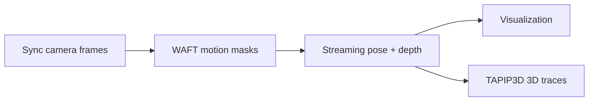

# 3D Trace Estimation Engine

This repo provides an end-to-end pipeline that turns **one or several folders
of frames extracted from synchronized camera videos** into the **3D trace of a
moving object**, along with camera poses and metric depth for the whole
sequence. It combines several models, each deployed with the runtime it fits
best (ONNX Runtime, TensorRT, TorchScript, or `torch.export` programs):

- **Any2Full** — RGB-D depth densification: grounds a Depth Anything prediction
  with the RGB-D sensor's sparse metric depth as a prompt, producing a densified
  metric point cloud (`torch.export` / `.pt2`).
- **WAFT** — dense optical flow, used to build motion masks.
- **DA3 / VGGT-Omega (streaming)** — multi-camera depth + camera pose estimation
  over long trajectories.
- **TAPIP3D** — 3D point tracking (traces).
- **SAM3** — promptable segmentation (`torch.export` / `.pt2`).

## Pipeline



1. **Input** — one or several folders of synchronized frames (one per camera),
   e.g. `demo_data/astribot_stereo_lrb/extract_frames/{stereo_left,stereo_right}`.
2. **Motion masks** — `scripts/infer_waft.sh` runs WAFT optical flow and
   thresholds the flow magnitude into per-pixel motion masks. The masks mark
   moving pixels; the next step uses them to **select static points for aligning
   the cameras over a long trajectory**.
3. **Camera pose + depth** — `scripts/infer_stream.sh` runs the streaming
   multi-camera model (VGGT-Omega or DA3) over the frames in sliding chunks and
   aligns the chunks into one consistent world frame, producing per-frame metric
   depth and camera poses for every view. `scripts/visualize_stream.sh` renders
   the depth and camera motion as a video.
4. **3D traces** — `scripts/infer_tapip3d.sh` runs TAPIP3D on top of the pose +
   depth output and tracks the object over time. You need to provide the
   **bounding box** of the tracked object (e.g. derived from a segmentation
   mask).

Each step is detailed below with its reference script and key flags.
Any2Full (single-frame RGB-D densification) is a separate capability, described
in its [own section](#rgb-d-depth-densification-any2full).

## Installation

Install the environment simply by:

```bash
uv sync
```

with pinned inference runtimes: `torch==2.11.0+cu128`,
`onnxruntime-gpu==1.28.0`, `tensorrt-cu12==11.1.0.106`.

## Layout

```
assets               # Astribot demo images + calibration (symlink)
src/
├── base/             # TRTModel / ONNXModel wrappers, CameraIntrinsics/Extrinsics
├── depth_models/
│   ├── a3f/          # Any2Full — RGB-D depth densification (.pt2)
│   ├── da3/          # Depth Anything 3 — any-view TorchScript backend + shared pre/post mixin
│   ├── streaming/    # chunked multi-camera streaming + long-trajectory alignment
│   └── vggt_omega/   # VGGT-Omega (torch.export program)
├── det_seg_models/
│   └── sam3/         # SAM3 promptable segmentation (.pt2)
├── flow_models/
│   ├── waft/         # WAFT optical flow (ONNX + TRT)
│   └── tapip3d/      # TAPIP3D 3D point tracking (ONNX)
└── utils/            # Astribot dataloader, image IO, visualization, streaming helpers
tools/
├── export_trt.py     # ONNX → TensorRT via trtexec
├── general_test/     # inference + visualization entry points
│   ├── run_stream.py # streaming (--backend da3|vggt_omega)
│   ├── infer_waft.py / infer_tapip3d.py
│   ├── test_any2full.py / test_sam3.py
│   └── visualize_stream.py / visualize_rgbd.py
├── astribot/         # Astribot dataset preprocessing (extract_frames: sub-task
│                     #   splits, key frames, per-subtask videos)
└── hifi-umi/         # HiFi-UMI dataset preprocessing (extract_frames, generate_masks)
scripts/              # ready-to-run pipeline scripts (infer_waft, infer_stream,
                      # visualize_stream, infer_tapip3d, export_trt_docker, ...)
weights/              # model weights (ONNX / TRT / TorchScript / .pt2)
```

The bundled sample data lives under `assets/`: `astribot_test_imgs/` (per-camera
RGB-D frames) plus `astribot_cam_calib/astribot_calibration_full_640x480.json`,
consumed by `tools/general_test/test_any2full.py` and `visualize_rgbd.py`
through `src/utils/astribot_dataloader.py`.

## Model weights

The model weights are expected under `weights/` in the following structure:

```
weights
├── any2full/
│   ├── Any2Full_vitl.pt2            # RGB-D densification, vit-large, fp32
│   └── Any2Full_vitl_bf16.pt2       # RGB-D densification, vit-large, bf16
├── vggt_omg/
│   └── vggt_omg_64x640x480_bf16.pt2 # VGGT-Omega streaming, fixed 64 views
├── da3/
│   ├── da3_anyview_24x644x490_giant-large-1.1.pt   # TorchScript (streaming)
│   └── da3_anyview_24x644x490_giant-large-1.1.pt2
├── sam3/
│   └── sam3_image_exported_bf16.pt2
├── waftv2/
│   ├── waftv2_dinov3_i5_640x480.onnx
│   ├── waftv2_dinov3_i5_640x480_tf32.engine
│   └── waftv2_dav2_i5_672x448.onnx
└── tapip3d/
    ├── tapip3d_encoder_480x640.onnx
    ├── tapip3d_updater.onnx
    └── tapip3d_corr_forward.onnx
```

## HOW to run scripts to generate 3D Trace

- **General-test tools** — per-script usage for the inference/visualization
  entry points in `tools/general_test` (optical flow, segmentation, depth
  densification, streaming, tracking) is documented in
  [`docs/general_test.md`](docs/general_test.md).
- **Astribot data extraction** — splitting LeRobot Astribot episodes into
  sub-task segments (ground-truth `subtask_index` preferred, gripper-based
  inference fallback), key-frame jpgs and per-subtask videos is documented in
  [`docs/astribot_extract_frames.md`](docs/astribot_extract_frames.md).
- **Astribot per-sub-task streaming** — streaming depth + pose per sub-task
  segment directly from the dataset (online frames, optional per-chunk WAFT
  masks) via `tools/astribot/run_subtask_stream.py` is documented in
  [`docs/astribot_subtask_stream.md`](docs/astribot_subtask_stream.md);
  rendering the per-segment trajectory videos (online frames, no inference)
  via `tools/astribot/visualize_subtask_stream.py` is documented in
  [`docs/astribot_visualize_subtask_stream.md`](docs/astribot_visualize_subtask_stream.md).
- See the per-model docs in [`docs/`](docs/) for model-specific usage notes
  (preprocessing, output formats, conventions).
