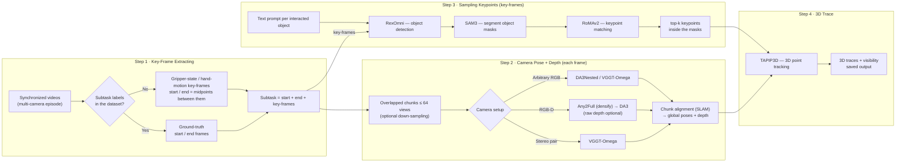
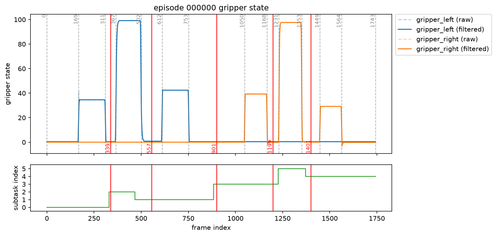
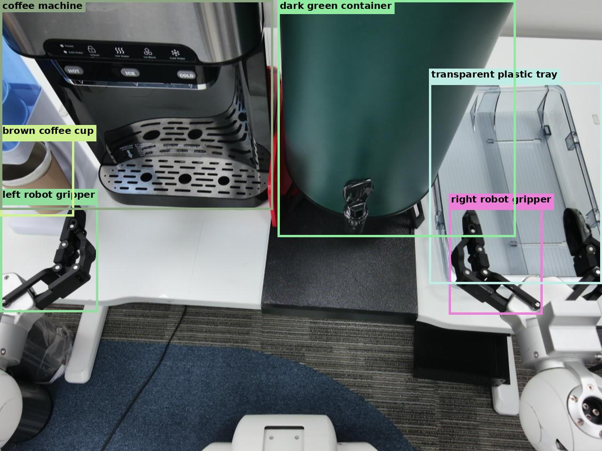
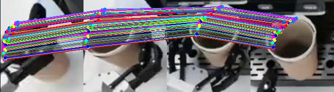
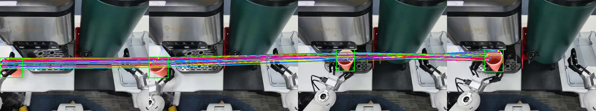

# 3D Trace Estimation Engine

This repo provides an end-to-end pipeline that extracts the **3D trace of the
interacting objects and robot hands** from synchronized multi-camera videos of
an episode. The episode is first split into subtasks (key-frame extracting);
for each subtask we estimate camera poses and metric depth (Stereo / RGB-D /
arbitrary-RGB backends), sample the keypoints of the interacting objects, and
track them across frames with a 3D trace model (see Section 3). It combines the
following models:

- **Any2Full** — RGB-D depth densification: grounds a Depth Anything prediction
  with the RGB-D sensor's sparse metric depth as a prompt, producing a densified
  metric point cloud.
- **RexOmni** — open-vocabulary object detection from a text prompt.
- **RoMAv2** — cross-frame keypoint matching for the objects / robot hands.
- **WAFT** — dense optical flow, used to build motion masks.
- **DA3 / VGGT-Omega (streaming)** — multi-camera depth + camera pose estimation
  over long trajectories.
- **TAPIP3D** — 3D point tracking (traces).
- **SAM3** — promptable segmentation.

## 1. Installation

Install the environment simply by:

```bash
uv sync
```

with pinned inference runtimes: `torch==2.11.0+cu128`,
`torchvision==0.26.0+cu128`.

### Rex-Omni environment

Rex-Omni uses a separate Python environment because its tested stack
(`torch==2.7.0`, `transformers==4.51.3`, and `vllm==0.9.1`) conflicts with the
main project environment. Set it up with:

```bash
bash scripts/general_test/setup_rexomni_env.sh
PYTHONPATH="$PWD/src" .venv-rexomni/bin/python tools/general_test/module/infer_rexomni.py
```

See [`docs/general_test/module/rexomni.md`](docs/general_test/module/rexomni.md)
for the wrapper API and its role in the pipeline (Step 3 object detection).

The Rex-Omni environment is intentionally not installed as an editable copy of
this project: the project metadata requires Python 3.12, while Rex-Omni uses
Python 3.10. `PYTHONPATH="$PWD/src"` exposes the repository's source packages
without installing the main project's dependencies into `.venv-rexomni`.

The setup script uses the prebuilt FlashAttention wheel when available. If that
wheel is unavailable for your platform, choose a matching wheel from the
[flash-attention-prebuild-wheels](https://mjunya.com/flash-attention-prebuild-wheels/?package=FA2&python=3.10&torch=2.7&cuda=12.8)
page and replace the `flash-attn` URL in the script. Do not install these Rex-Omni
packages into the main environment.


## 2. Model weights

To avoid environment conflicting when using different models within the same repo, the model checkpoints are already converted to Torch.Export or ONNX. The converted model weights are hosted on Hugging Face at
[`Chuong98vt/TraceEngine`](https://huggingface.co/Chuong98vt/TraceEngine).
Download them and point `weights/` at the download folder:

```bash
pip install -U "huggingface_hub[cli]"
hf download Chuong98vt/TraceEngine --local-dir <download_weight_folder>
ln -s <download_weight_folder> weights
```

> If a `weights/` directory already exists (e.g. an empty placeholder), remove
> it first — `ln -s <download_weight_folder> weights` would otherwise create
> the symlink *inside* the existing directory.

Expected layout (mirrors the repo layout):

```
weights
├── any2full/
│   └── Any2Full_vitl_bf16.pt2            # RGB-D densification, vit-large, bf16
├── vggt_omg/
│   └── vggt_omg_64x640x480_bf16.pt2      # VGGT-Omega streaming, fixed 64 views
├── da3/
│   ├── da3_anyview_64x644x490_giant-large-1.1_bf16.pt2   # any-view, fixed 64 views
│   └── da3_metric_644x490_giant-large-1.1_bf16.pt2       # metric depth
├── romav2/
│   ├── romav2.pt2                        # multi-image keypoint matching (exported .pt2)
│   └── romav2.json                       # export config: H_lr / W_lr
├── sam3/
│   └── sam3_image_exported_bf16.pt2
├── waftv2/
│   └── waftv2_dinov3_i5_640x480_bf16.pt2  # WAFT optical flow (torch.export .pt2, bf16)
└── tapip3d/
    ├── tapip3d_encoder_480x640_bf16.pt2
    └── tapip3d_iteration_1088_bf16.pt2   # fixed 1088-query iteration model
```

## 3. Pipeline

Given synchronized videos from different cameras of an episode, the pipeline
first splits the video into several subtasks (Step 1); Steps 2–4 are then
performed **for each subtask**:

1. **Key-Frame Extracting** — split the episode into subtasks, each with a
   start frame, an end frame, and several key-frames.
2. **Camera Pose and Depth** — compute the camera poses and depth images for
   each frame.
3. **Sampling Keypoints** — sample the keypoints of the interacting objects
   and the robot hands.
4. **3D Trace** — feed the outputs of Steps 2 and 3 to a 3DTrace model to
   track the keypoints across frames and save the output.



### Step 1 — Key-Frame Extracting

Each subtask has a start frame, an end frame, and several key-frames.

- The key-frames can be extracted autonomously based on the **gripper-state**
  (close / open) for a robot dataset.
- For datasets that have subtask labels, the ground-truth frame indexes are
  used for the start / end frames. Otherwise, the subtask start / end frames
  are computed as the **middle points between two key-frames**.
- For human datasets, the key-frames can be computed based on the **hand
  motion**, similar to the gripper (To-Do). Otherwise, they can be uniformly
  sampled, e.g. every 1–2 seconds.

The figure below shows the detected key-frame indexes of an episode: each
subtask spans from its start frame to its end frame, with the key-frames marked
in between.

<p align="center">
  
</p>

### Step 2 — Compute the Camera Pose and Depth Images

Due to memory limits, a camera-pose estimation model can only run on a small
batch of frames, e.g. 64 frames at most. To run inference over longer
sequences, we provide the base class `tools/general_test/pipeline/run_depth_stream.py`, which
splits a long sequence into several **overlapped chunks**. The SLAM backend
aligns the camera-pose results from each chunk together to create global
camera poses. The user can also **down-sample** the sequence, e.g. setting
`interval=4` skips every 4 frames during inference. Depending on the camera
FPS, down-sampling can effectively reduce the computation and extend the
inference over a longer sequence.

Different front-end camera-pose and depth models are supported by camera
setup:

- **Stereo camera pair** — we use **VGGT-Omega**.
- **RGB-D cameras** — we first use **Any2Full** to densify the raw depth
  sensor (which is sparse), then feed it to **Depth Anything 3** to compute
  camera poses and align the depth image. Any2Full can optionally be skipped
  and the raw depth used directly.
- **Arbitrary RGB cameras** — either **DA3Nested** or **VGGT-Omega** produce
  both depth and camera poses.

The video below shows the depth stream of an episode — estimated per-view
metric depth and camera poses rendered along the trajectory:

<p align="center">
  <video src="docs/assets/step2_depth_stream.mp4" alt="Depth stream: camera pose and depth per frame" width="800" controls></video>
</p>

### Step 3 — Sampling Keypoints

For each subtask, we require a text prompt for each interacted object, which
can be extracted from the subtask description. Given the text prompt:

1. **RexOmni** detects the objects in each key-frame (start / end frames
   included).

   <p align="center">
     
   </p>

2. The bounding boxes and their corresponding text prompts are used as the
   prompts for **SAM3** to segment the object masks.
3. The bounding boxes are enlarged with a scale and used to crop the objects
   from the key-frames; the cropped object images are then passed to
   **RoMAv2** to find matching keypoints consistent across the key-frames of a
   subtask.

   <p align="center">
     
   </p>

4. Only the **top-k** keypoints that belong to the object masks are kept.

The figure below shows the final sampled keypoints of the interacted objects
across the key-frames of a subtask:

<p align="center">
  
</p>

### Step 4 — 3D Trace

We use **TAPIP3D** to track the 3D positions of the keypoints detected in
Step 3, from the first frame to the last frame of each subtask, and save the
output.

The video below shows the 3D traces of the tracked keypoints across the frames:

<p align="center">
  <video src="docs/assets/step4_tapip.mp4" alt="3D traces of the tracked keypoints (TAPIP3D)" width="800" controls></video>
</p>

## 4. Run Inference

The `tools/` folder is the working entry point. Depending on the dataset
size, use one of two tool sets:

### Case 1 — General purpose: test each component individually (`tools/general_test`)

The `tools/general_test` scripts run **one model at a time** on a
**folder of input images** (or a single example image), independent of any
dataset. This is where each individual component is tested and verified:
WAFT optical flow, SAM3 segmentation, Any2Full depth densification,
DA3 / VGGT-Omega streaming, TAPIP3D tracking, RexOmni detection, RoMAv2
keypoint matching. Per-tool usage is documented in
[`docs/general_test/general_test.md`](docs/general_test/general_test.md).

To get sample image folders, first extract frames from a LeRobotDataset —
the sample dataset is
[`Kronze157/astri_making_coffee_vlva`](https://huggingface.co/datasets/Kronze157/astri_making_coffee_vlva)
on Hugging Face:

```bash
export DATA_DIR=/data/astribot_coffee_making_vlva
hf download Kronze157/astribot_coffee_making_vlva --local-dir $DATA_DIR
```

then extract frames

```bash
python tools/astribot/extract_frames.py \
    --repo-id Kronze157/astri_making_coffee_vlva \
    --data-root $DATA_DIR \
    --mode frames --camera-idxes 0 1 --interval 4 --max-frames 50
```
It will extract frames from cameras 0 and 1, you can select other camera indexes from the table printed in terminal. Then continue to follow the [`docs/general_test/general_test.md`](docs/general_test/general_test.md) to finish the steps.

### Case 2 — Large datasets: online / streaming from the dataset (`tools/astribot`)

For large datasets, extracting every frame to jpg is impractical. The
`tools/astribot` scripts instead stream **online, directly from the
LeRobotDataset** — frames are decoded one chunk at a time and never written
to disk, so no extracted frames or per-subtask videos are needed. Sub-task
splits are taken from the ground-truth `subtask_index` column (gripper-based
inference fallback).

- `run_step2_depth_stream.py` — per-sub-task depth + pose streaming (DA3 /
  VGGT-Omega / Any2Full backends, optional per-chunk WAFT motion masks).
- `run_subtask_a3f.py` — per-sub-task Any2Full RGB-D densification (RGB-D
  cameras only).
- `visualize_subtask_stream.py` — trajectory video per sub-task, rendered
  online from the saved pipeline outputs (no re-inference).
- `extract_frames.py` — shared dataset introspection + sub-task splitting
  (also the frame-extraction script of case 1).

```bash
python tools/astribot/run_step2_depth_stream.py \
    --repo-id Kronze157/astri_making_coffee_vlva \
    --data-root <dataset_dir> --episode-idxes 0 --backend vggt_omega
```

The docs live in [`docs/astribot/`](docs/astribot/):
[`astribot_extract_frames.md`](docs/astribot/astribot_extract_frames.md),
[`astribot_subtask_depth_stream.md`](docs/astribot/astribot_subtask_depth_stream.md),
[`astribot_visualize_subtask_depth_stream.md`](docs/astribot/astribot_visualize_subtask_depth_stream.md).
