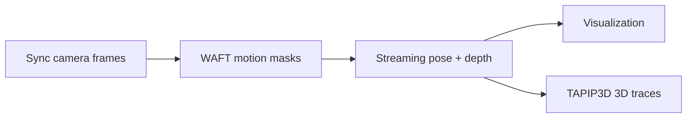

# 3D Trace Estimation Engine

This repo provides an end-to-end pipeline that turns **one or several folders
of frames extracted from synchronized camera videos** into the **3D trace of a
moving object**, along with camera poses and metric depth for the whole
sequence. It combines several models, each deployed with the runtime it fits
best (ONNX Runtime, TensorRT, TorchScript, or `torch.export` programs):

- **Any2Full** — RGB-D depth densification: grounds a Depth Anything prediction
  with the RGB-D sensor's sparse metric depth as a prompt, producing a densified
  metric point cloud (`torch.export` / `.pt2`).
- **WAFT** — dense optical flow, used to build motion masks.
- **DA3 / VGGT-Omega (streaming)** — multi-camera depth + camera pose estimation
  over long trajectories.
- **TAPIP3D** — 3D point tracking (traces).
- **SAM3** — promptable segmentation (`torch.export` / `.pt2`).

## Pipeline



1. **Input** — one or several folders of synchronized frames (one per camera),
   e.g. `demo_data/astribot_stereo_lrb/extract_frames/{stereo_left,stereo_right}`.
2. **Motion masks** — `scripts/infer_waft.sh` runs WAFT optical flow and
   thresholds the flow magnitude into per-pixel motion masks. The masks mark
   moving pixels; the next step uses them to **select static points for aligning
   the cameras over a long trajectory**.
3. **Camera pose + depth** — `scripts/infer_stream.sh` runs the streaming
   multi-camera model (VGGT-Omega or DA3) over the frames in sliding chunks and
   aligns the chunks into one consistent world frame, producing per-frame metric
   depth and camera poses for every view. `scripts/visualize_stream.sh` renders
   the depth and camera motion as a video.
4. **3D traces** — `scripts/infer_tapip3d.sh` runs TAPIP3D on top of the pose +
   depth output and tracks the object over time. You need to provide the
   **bounding box** of the tracked object (e.g. derived from a segmentation
   mask).

Each step is detailed below with its reference script and key flags.
Any2Full (single-frame RGB-D densification) is a separate capability, described
in its [own section](#rgb-d-depth-densification-any2full).

## Installation

Install the environment simply by:

```bash
uv sync
```

with pinned inference runtimes: `torch==2.11.0+cu128`,
`onnxruntime-gpu==1.28.0`, `tensorrt-cu12==11.1.0.106`.

## Layout

```
assets               # Astribot demo images + calibration (symlink)
src/
├── base/             # TRTModel / ONNXModel wrappers, CameraIntrinsics/Extrinsics
├── depth_models/
│   ├── a3f/          # Any2Full — RGB-D depth densification (.pt2)
│   ├── da3/          # Depth Anything 3 — any-view TorchScript backend + shared pre/post mixin
│   ├── streaming/    # chunked multi-camera streaming + long-trajectory alignment
│   └── vggt_omega/   # VGGT-Omega (torch.export program)
├── det_seg_models/
│   └── sam3/         # SAM3 promptable segmentation (.pt2)
├── flow_models/
│   ├── waft/         # WAFT optical flow (ONNX + TRT)
│   └── tapip3d/      # TAPIP3D 3D point tracking (ONNX)
└── utils/            # Astribot dataloader, image IO, visualization, streaming helpers
tools/
├── export_trt.py     # ONNX → TensorRT via trtexec
├── general_test/     # inference + visualization entry points
│   ├── run_stream.py # streaming (--backend da3|vggt_omega)
│   ├── infer_waft.py / infer_tapip3d.py
│   ├── test_any2full.py / test_sam3.py
│   └── visualize_stream.py / visualize_rgbd.py
├── astribot/         # Astribot dataset preprocessing (extract_frames: sub-task
│                     #   splits, key frames, per-subtask videos)
└── hifi-umi/         # HiFi-UMI dataset preprocessing (extract_frames, generate_masks)
scripts/              # ready-to-run pipeline scripts (infer_waft, infer_stream,
                      # visualize_stream, infer_tapip3d, export_trt_docker, ...)
weights/              # model weights (ONNX / TRT / TorchScript / .pt2)
```

The bundled sample data lives under `assets/`: `astribot_test_imgs/` (per-camera
RGB-D frames) plus `astribot_cam_calib/astribot_calibration_full_640x480.json`,
consumed by `tools/general_test/test_any2full.py` and `visualize_rgbd.py`
through `src/utils/astribot_dataloader.py`.

## Model weights

The model weights are expected under `weights/` in the following structure:

```
weights
├── any2full/
│   ├── Any2Full_vitl.pt2            # RGB-D densification, vit-large, fp32
│   └── Any2Full_vitl_bf16.pt2       # RGB-D densification, vit-large, bf16
├── vggt_omg/
│   └── vggt_omg_64x640x480_bf16.pt2 # VGGT-Omega streaming, fixed 64 views
├── da3/
│   ├── da3_anyview_24x644x490_giant-large-1.1.pt   # TorchScript (streaming)
│   └── da3_anyview_24x644x490_giant-large-1.1.pt2
├── sam3/
│   └── sam3_image_exported_bf16.pt2
├── waftv2/
│   ├── waftv2_dinov3_i5_640x480.onnx
│   ├── waftv2_dinov3_i5_640x480_tf32.engine
│   └── waftv2_dav2_i5_672x448.onnx
└── tapip3d/
    ├── tapip3d_encoder_480x640.onnx
    ├── tapip3d_updater.onnx
    └── tapip3d_corr_forward.onnx
```

### Precompiled weights

For convenience, ONNX checkpoints can be downloaded from Hugging Face
[Chuong98vt/DepthModels](https://huggingface.co/Chuong98vt/DepthModels/tree/main). Model name conventions:

- **Any2Full**: `Any2Full_vitl` — vit-large backbone, exported at a fixed
  480×640 input; `_bf16` variants run the exported graph in bf16.
- **VGGT-Omega (streaming)**: `vggt_omg_64x640x480` — fixed 64 views per chunk,
  inference at 640×480.
- **DA3 (streaming)**: `da3_anyview_24x644x490` — fixed 24 views per chunk,
  644×490 (must be divisible by 14).
- **WAFT**: `waftv2_dinov3_i5_640x480` — optical flow with DINOv3-small
  backbone, 5 iterative refinements, inferred at 640×480.
- **TAPIP3D**: `tapip3d_encoder_480x640` / `tapip3d_updater` / `tapip3d_corr_forward`
  — the updater is exported for a **fixed query count (1088)**.

(Optional) To export the ONNX models yourself, clone the PyTorch source repos
and run their `export_onnx.py`:
- DA3: https://github.com/Chuong98CC/Depth-Anything-3
- WAFT: https://github.com/Chuong98CC/WAFT
- TAPIP3D / VGGT-Omega / Any2Full: see the model sources for the export scripts.

### Export ONNX → TensorRT

Export a TRT engine using Docker simply by:

```bash
bash scripts/export_trt_docker.sh /abs/path/to/model.onnx fp16 (or fp32)
```

- For the WAFT model, the precision `fp32` is required.
- Other models can be exported with `fp16` for lower memory inference.

## Step-by-step details

The steps below mirror the demo scripts in `scripts/` (data paths are the
`demo_data/astribot_stereo_lrb` sequence, a two-camera stereo rig).

### 1. Input data

Prepare one folder of extracted frames per synchronized camera, with matching
frame stems across folders:

```
demo_data/astribot_stereo_lrb/extract_frames/stereo_left/frame_*.jpg
demo_data/astribot_stereo_lrb/extract_frames/stereo_right/frame_*.jpg
```

### 2. Motion masks (WAFT optical flow)

`scripts/infer_waft.sh` runs WAFT on a frame folder and thresholds the flow
magnitude into binary motion masks:

```bash
python tools/general_test/infer_waft.py --input <frames_dir> --backend trt \
    --checkpoint weights/waftv2/waftv2_dinov3_i5_640x480_tf32.engine \
    --start 210 --stride 4 -thr 2 -o mask \
    --output-dir demo_data/astribot_stereo_lrb/motion_mask/
```

- `--stride 4` pairs frames 4 apart; `-thr 2` is the flow-magnitude (pixel
  displacement) threshold above which a pixel counts as moving.
- Output: per-frame masks under
  `<output-dir>/<video_name>/mask/` (e.g. `stereo_left/mask/`). Pixels above
  127 are moving.
- Run once per camera; the masks are consumed by the streaming step, where
  moving-pixel confidence is zeroed so that **only static points drive the
  long-trajectory camera alignment**.

### 3. Camera pose and depth (streaming)

`scripts/infer_stream.sh` runs the streaming multi-camera model over all camera
folders in sliding chunks and aligns the chunks into a single world frame:

```bash
python tools/general_test/run_stream.py \
    --backend vggt_omega \            # or "da3"
    --input-dirs <left_frames_dir> <right_frames_dir> \
    --mask-dirs <left_mask_dir> <right_mask_dir> \
    --start-frame 210 --max-frames 160 --interval 4 \
    --model-path weights/vggt_omg/vggt_omg_64x640x480_bf16.pt2 \
    --output-dir output/masked_stream_stereo_vggt_omega
```

- `--backend` selects the pre-exported model: `vggt_omega` (VGGT-Omega
  `torch.export` program) or `da3` (TorchScript any-view). Both exports have a
  **fixed number of views**, which is read from the model — the chunk size is
  derived automatically (64 for the shipped VGGT-Omega export, 24 for DA3), so
  `--model-path` is only needed to override the backend's default weight.
- `--mask-dirs` (optional) supplies the motion masks from step 2, used during
  chunk alignment only — outputs are unaffected.
- `--interval 4` / `--max-frames` subsample the sequence (every 4th frame).
- Output: per camera folder `depth_<camera_name>/frame_<idx>.npz` containing
  `depth` (H, W, metric), `extrinsics` (3×4, world→camera), `intrinsics`
  (3×3), plus `timings.json`. A short final chunk is padded automatically.
- Add `--video` to render the trajectory video right after the run.

**Visualization** — `scripts/visualize_stream.sh` renders the saved results as
a video of the coloured depth point cloud with camera frustums and the growing
camera path:

```bash
python tools/general_test/visualize_stream.py \
    --input-dirs <left_frames_dir> <right_frames_dir> \
    --result-dir output/masked_stream_stereo_vggt_omega \
    --output output/masked_stream_stereo_vggt_omega/vggt_omega_stream.mp4 \
    --fps 30 --size 960x540
```

### 4. 3D traces (TAPIP3D)

`scripts/infer_tapip3d.sh` tracks the object in 3D over the sequence, using the
frames plus per-frame geometry (depth + camera poses) of the view the object is
tracked in:

```bash
python tools/general_test/infer_tapip3d.py \
    --encoder weights/tapip3d/tapip3d_encoder_480x640.onnx \
    --updater weights/tapip3d/tapip3d_updater.onnx \
    --corr_forward weights/tapip3d/tapip3d_corr_forward.onnx \
    --image_dir <frames_dir> \
    --npz_dir <geometry_dir> \
    --output_dir output/tapip3d_stereo_left_onnx \
    --start_frame 210 --fps 4 \
    --bbox 200 265 260 300 \          # x0 y0 x1 y1 of the tracked object
    --grid_x 8 --grid_y 8 --support_grid_size 32 \
    --num_iters 6 --vis_threshold 0.5 --visualize
```

- `--bbox x0 y0 x1 y1` selects the object to track (derive it from a
  segmentation mask if you have one). A grid of points inside the bbox is
  unprojected to world-space queries using the first frame's depth and pose.
- `--npz_dir` is the geometry folder: per-frame `frame_<idx>.npz` with
  `depth` (H, W), `extrinsic` (4×4, world→camera) and `intrinsic` (3×3) — i.e.
  the pose + depth output of step 3 (the demo sequence ships with a
  pre-generated copy under `demo_data/astribot_stereo_lrb/geometry/`).
- The shipped updater ONNX has a **fixed query count (1088)**: the default
  8×8 bbox grid (64) + 32×32 support grid (1024) matches it exactly; the
  script exits with a clear error otherwise (e.g. depth holes in the bbox drop
  points).
- `--fps 4` subsamples the sequence (inference runs at 4 Hz on the 30 Hz data).
- Output: `coords.npy` (T, Q, 3) — the world-space 3D traces, `visibs.npy`
  (T, Q) — per-point visibility, and `metadata.json`. With `--visualize` a
  rendering of the tracks is saved as a video.

## RGB-D depth densification (Any2Full)

A standalone single-frame capability: **Any2Full** turns an RGB image plus the
RGB-D sensor's **sparse metric depth into a densified metric depth map** — and
therefore a denser, higher-quality point cloud — by using the sensor depth as a
*prompt* to ground the prediction of a Depth Anything model.

The runtime is `depth_models.a3f.any2full.Any2Full_PT2`, a `torch.export`
wrapper with deterministic pre/post processing:

- **Preprocess** — ImageNet-normalized RGB and the sparse metric depth are
  resized to the exported **fixed 480×640** input (any input size is accepted).
- **Infer** — the exported graph runs with `init_scaling` disabled and returns
  `(depth, disparity_pre, prompt_depth_resized)`.
- **Postprocess** — metric scale is recovered with a **deterministic affine
  least-squares fit** of the predicted disparity against the sparse depth
  anchors (`init_scaling`, no random jitter), converted disparity → depth,
  un-resized to the input resolution and clamped to `[min_depth, max_depth]`.
- Optional **denoising** of the sparse depth (`remove_outliers`, a scipy
  `generic_filter` that drops isolated / anomalous depth points without
  filling).

Run it on an Astribot head RGB-D frame and export the point cloud as a `.glb`:

```bash
python tools/general_test/test_any2full.py \
    --pt2 weights/any2full/Any2Full_vitl_bf16.pt2 \
    --frame_idx 0 \
    --out_dir ./outputs
```

- `--camera_name` selects the Astribot camera (`head_rgbd` by default; also
  `torso_rgbd`, wrist cameras). Frames are loaded through
  `utils.astribot_dataloader.load_rgbd`, which returns the metric depth in
  metres and the calibrated intrinsics/extrinsics.
- `--denoise` enables sparse-depth denoising before inference (`--denoise_threshold`,
  `--denoise_min_valid`, `--denoise_kernel_size`).
- `--init_scaling` (default on) enables the affine scale recovery; turn it off
  to use the raw graph depth.
- `--max_depth` / `--min_depth` clamp the final output (default 10 m / 0).
- Output: `frame_<idx>.glb` (coloured point cloud back-projected with the
  camera intrinsics), `frame_<idx>.npy` (metric depth), `frame_<idx>.png`
  (colour-mapped depth).

## Notes

- **General-test tools** — per-script usage for the inference/visualization
  entry points in `tools/general_test` (optical flow, segmentation, depth
  densification, streaming, tracking) is documented in
  [`docs/general_test.md`](docs/general_test.md).
- **Astribot data extraction** — splitting LeRobot Astribot episodes into
  sub-task segments (ground-truth `subtask_index` preferred, gripper-based
  inference fallback), key-frame jpgs and per-subtask videos is documented in
  [`docs/astribot_extract_frames.md`](docs/astribot_extract_frames.md).
- See the per-model docs in [`docs/`](docs/) for model-specific usage notes
  (preprocessing, output formats, conventions).
