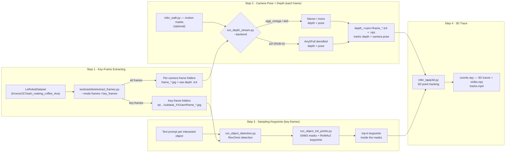

# General-Test Tools (`tools/general_test`)

Inference + visualization entry points for **testing and verifying the
pipeline** — the "Case 1" tool set of the repo README. The scripts in this
folder are general-purpose: they run on a **folder of images**.

To get sample image folders, first extract frames from a LeRobotDataset with
`tools/astribot/extract_frames.py` (sample dataset
[`Kronze157/astri_making_coffee_vlva`](https://huggingface.co/datasets/Kronze157/astri_making_coffee_vlva)).
Model weights are expected under `weights/` (see the repo README §2 for the
Hugging Face download + symlink). All scripts can be run from the repo root
after `uv sync`.

## Where should I look?

The tests are organized in two categories:

- **Module tests** ([`module/`](module/)) — verify **one model component in
  isolation** (e.g. "does SAM3 segment this box?"). One doc per model, ordered
  by the pipeline step the model serves.
- **Pipeline tests** ([`pipeline/`](pipeline/)) — verify a **README pipeline
  step end-to-end** (e.g. "does Step 2 produce depth + pose for my frame
  folders?"). Each page has a quickstart, the expected output layout, and a
  verification checklist.

Testing a single model → jump straight to its module doc. Verifying an
entire step → run the pipeline test and use its module pointers for details.

## Pipeline overview

1. **Step 1: Key-frame extracting** — `tools/astribot/extract_frames.py` turns the
   LeRobotDataset into synchronized per-camera frame folders (paired with
   log-encoded uint8 depth `.lz4` where the camera has a depth feature); each subtask has
   a start, an end and several key-frames (ground-truth indexes, gripper-state,
   or uniform sampling — see the repo README §3).
2. **Step 2: Camera depth + pose estimation** — `run_depth_stream.py` streams the frame
   folders through a depth+pose backend in sliding chunks aligned into one
   world frame: `vggt_omega` / `da3` (mono/stereo) or `a2f` (RGB-D, Any2Full
   densification). Optional WAFT motion masks (`infer_waft.py`) zero the
   confidence of moving pixels during chunk alignment. → **[Pipeline test:
   `pipeline/step2.md`](pipeline/step2.md)**
3. **Step 3: Sampling keypoints** — per sub-task, the object prompts come from
   the dataset's `meta/subtasks.csv` annotations (the `manipulator`/`object`
   columns of the sub-task's row) and drive detection on the key-frames
   (`run_object_detection.py`, Rex-Omni); the boxes + text prompt segment
   the object masks (`run_object_init_points.py`, SAM3); the enlarged box
   crops are matched across the key-frames (RoMAv2, mask-cropped so points are
   sampled inside the object only) and only the top-k keypoints inside the
   masks are kept. → **[Pipeline test:
   `pipeline/step3.md`](pipeline/step3.md)**
4. **Step 4: 3D traces** — `infer_tapip3d.py` tracks the world-space positions of the
   sampled keypoints (plus a support grid) through the depth + pose output,
   from the first to the last frame of the subtask.

## Module tests (`module/`)

Each module doc tests **one model component** in isolation — the tool, its
CLI, its output, and how it plugs into the pipeline. Ordered by pipeline step:

| Step | Module | Tool | What it does | Runtime | Wrapper script |
|---|---|---|---|---|---|
| 2 | [`streaming.md`](module/streaming.md) | `run_depth_stream.py` / `visualize_stream.py` | streaming multi-camera depth + pose (incl. RGB-D `a2f`), trajectory video | DA3 / VGGT-Omega / Any2Full (`.pt2`) | `scripts/general_test/infer_stream_stereo.sh`, `infer_stream_rgbd.sh`, `visualize_stream.sh` |
| 2 | [`any2full.md`](module/any2full.md) | `infer_any2full.py` | RGB-D depth densification (the `a2f` backend component) | Any2Full (`.pt2`) | — |
| 2 (opt.) | [`waft.md`](module/waft.md) | `infer_waft.py` | dense optical flow → motion masks (zero moving pixels during chunk alignment) | WAFTv2 (`.pt2`) | `scripts/general_test/infer_waft.sh` |
| 3 | [`rexomni.md`](module/rexomni.md) | `infer_rexomni.py` | open-vocabulary object detection from a text prompt | Rex-Omni (`.venv-rexomni`) | `scripts/general_test/setup_rexomni_env.sh` |
| 3 | [`sam3.md`](module/sam3.md) | `infer_sam3.py` | promptable segmentation (box + text) | SAM3 (`.pt2`) | — |
| 3 | [`romav2.md`](module/romav2.md) | `infer_romav2.py` | multi-image keypoint matching (points visible in all images) | RoMAv2 (`.pt2`) | `scripts/general_test/infer_romav2.sh` |
| 4 | [`tapip3d.md`](module/tapip3d.md) | `infer_tapip3d.py` | 3D point tracking over long videos | TAPIP3D (`.pt2`) | `scripts/general_test/infer_tapip3d.sh` |
| — | [`visualize_rgbd.md`](module/visualize_rgbd.md) | `visualize_rgbd.py` | RGB-D visualization (image / depth-lz4 + pose-npz folder pair) | — (rendering) | — |

## Pipeline tests (`pipeline/`)

Each pipeline test runs a **README step end-to-end** on a folder of images
and verifies the output contract:

| Step | Page | What it verifies | Entry points |
|---|---|---|---|
| 2 | [`step2.md`](pipeline/step2.md) | Camera pose + depth: chunked streaming → SIM3 alignment → per-frame `depth` + `pose` outputs | `run_depth_stream.py`, `infer_stream_stereo.sh`, `infer_stream_rgbd.sh`, `visualize_stream.sh` |
| 3 | [`step3.md`](pipeline/step3.md) | Sampling keypoints: RexOmni detections (3a) → SAM3 masks + RoMAv2 keypoints (3b) | `run_e2e_init_points.py`, `infer_step3.sh`, `run_step3_init_points.py` (dataset mode) |

## Ready-to-run scripts (`scripts/general_test/`)

Thin wrappers around the tools above, hard-coded for the Astribot sample
extraction:

| Script | What it runs |
|---|---|
| `infer_waft.sh` | WAFTv2 motion masks on a demo frame folder (`.pt2` artifact, `-thr 2`) |
| `infer_stream_stereo.sh` | Stereo streaming (`da3` / `vggt_omega`) on the sample extraction, then renders the trajectory video |
| `infer_stream_rgbd.sh` | RGB-D streaming (`a2f` backend) on the sample extraction, then renders the trajectory video |
| `infer_tapip3d.sh` | 3D point tracking of the coffee cup (`--bbox 1 240 100 340 --text_prompt "brown coffee cup"`), env-configurable via `IMG_DIR` / `DEPTH_DIR` / `OUTPUT_DIR` |
| `infer_romav2.sh` | RoMAv2 keypoint matching across the `assets/matching_points/coffee{1..4}.png` key-frames (`--strategy reference --num-corresp 2000 --top-k 128`) |
| `infer_step3.sh` | Step 3 on a key-frame folder (3a + 3b, see [`pipeline/step3.md`](pipeline/step3.md)) |
| `setup_rexomni_env.sh` | Create the `.venv-rexomni` environment (torch 2.7 / transformers 4.51.3, Python 3.10); run the tool with `PYTHONPATH="$PWD/src" .venv-rexomni/bin/python tools/general_test/pipeline/run_object_detection.py` |
| `visualize_stream.sh` | Trajectory video from a streaming result |

## Relation to dataset-specific tools

The scripts in this folder are the **general-purpose reference entry
points**. Dataset-specific tool folders reuse their functions but optimize
for a particular dataset:

- `tools/astribot` — Astribot dataset helpers: `extract_frames.py` (the
  sample-frame producer above) and the online streaming tools that never
  write frames to disk (see [`docs/astribot/`](../astribot/)). The
  `tools/astribot` streamers reuse the same streaming backend classes and
  the same output contract, so the same visualizers load their results.
  `run_step3_init_points.py` is the dataset-mode driver of the Step-3 pipeline
  (see [`pipeline/step3.md`](pipeline/step3.md)).
- `tools/hifi-umi` — HiFi-UMI dataset preprocessing (`extract_frames.py`,
  `generate_masks.py`), reusing the same model entry points.

See `docs/astribot/` for the "Case 2" online-streaming workflow of the repo
README.
