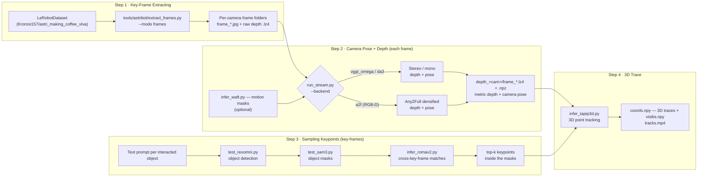

# General-Test Tools (`tools/general_test`)

Inference + visualization entry points for **testing and verifying each
model's performance** — the "Case 1" tool set of the repo README. The scripts
in this folder are general-purpose: they run on a **folder of images**.

To get sample image folders, first extract frames from a LeRobotDataset with
`tools/astribot/extract_frames.py` (sample dataset
[`Kronze157/astri_making_coffee_vlva`](https://huggingface.co/datasets/Kronze157/astri_making_coffee_vlva)).
Model weights are expected under `weights/` (see the repo README §2 for the
Hugging Face download + symlink). All scripts can be run from the repo root
after `uv sync`.

## Pipeline overview

1. **Key-frame extracting** — `tools/astribot/extract_frames.py` turns the
   LeRobotDataset into synchronized per-camera frame folders (paired with raw
   uint16 depth `.lz4` where the camera has a depth feature); each subtask has
   a start, an end and several key-frames (ground-truth indexes, gripper-state,
   or uniform sampling — see the repo README §3).
2. **Camera depth + pose estimation** — `run_stream.py` streams the frame
   folders through a depth+pose backend in sliding chunks aligned into one
   world frame: `vggt_omega` / `da3` (mono/stereo) or `a2f` (RGB-D, Any2Full
   densification). Optional WAFT motion masks (`infer_waft.py`) zero the
   confidence of moving pixels during chunk alignment.
3. **Sampling keypoints** — for each interacted object, a text prompt from
   the subtask description drives detection on the key-frames
   (`test_rexomni.py`, Rex-Omni); the boxes + text prompt segment the object
   masks (`test_sam3.py`, SAM3); the enlarged box crops are matched across the
   key-frames (`infer_romav2.py`, RoMAv2) and only the top-k keypoints inside
   the masks are kept.
4. **3D traces** — `infer_tapip3d.py` tracks the world-space positions of the
   sampled keypoints (plus a support grid) through the depth + pose output,
   from the first to the last frame of the subtask.

## Tool index

Ordered to follow the repo README §3 pipeline steps (Step 1 — key-frame
extracting — lives in `tools/astribot/extract_frames.py`, which produces the
frame folders everything below consumes):

| # | Step | Tool | What it does | Runtime | Doc | Wrapper script |
|---|---|---|---|---|---|---|
| 1 | 2 | `run_stream.py` / `visualize_stream.py` | streaming multi-camera depth + pose (incl. RGB-D `a2f`), trajectory video | DA3 / VGGT-Omega / Any2Full (`.pt2`) | [`streaming.md`](streaming.md) (+ [`visualize_stream.md`](visualize_stream.md) for the renderer) | `scripts/general_test/infer_stream_stereo.sh`, `infer_stream_rgbd.sh`, `visualize_stream.sh` |
| 2 | 2 | `test_any2full.py` | RGB-D depth densification (the `a2f` backend component) | Any2Full (`.pt2`) | [`any2full.md`](any2full.md) | — |
| 3 | 2 (opt.) | `infer_waft.py` | dense optical flow → motion masks (zero moving pixels during chunk alignment) | WAFT (ONNX / TensorRT) | [`waft.md`](waft.md) | `scripts/general_test/infer_waft.sh` |
| 4 | 3 | `test_rexomni.py` | open-vocabulary object detection from a text prompt | Rex-Omni (`.venv-rexomni`) | [`rexomni.md`](rexomni.md) | `scripts/general_test/setup_rexomni_env.sh` |
| 5 | 3 | `test_sam3.py` | promptable segmentation (box + text) | SAM3 (`.pt2`) | [`sam3.md`](sam3.md) | — |
| 6 | 3 | `infer_romav2.py` | multi-image keypoint matching (points visible in all images) | RoMAv2 (`.pt2`) | [`romav2.md`](romav2.md) | `scripts/general_test/infer_romav2.sh` |
| 7 | 4 | `infer_tapip3d.py` | 3D point tracking over long videos | TAPIP3D (`.pt2`) | [`tapip3d.md`](tapip3d.md) | `scripts/general_test/infer_tapip3d.sh` |
| 8 | — | `visualize_rgbd.py` | RGB-D visualization (image / depth-lz4 + pose-npz folder pair) | — (rendering) | [`visualize_rgbd.md`](visualize_rgbd.md) | — |

## Ready-to-run scripts (`scripts/general_test/`)

Thin wrappers around the tools above, hard-coded for the Astribot sample
extraction:

| Script | What it runs |
|---|---|
| `infer_waft.sh` | WAFT motion masks on a demo frame folder (TRT engine, `-thr 2`) |
| `infer_stream_stereo.sh` | Stereo streaming (`da3` / `vggt_omega`) on the sample extraction, then renders the trajectory video |
| `infer_stream_rgbd.sh` | RGB-D streaming (`a2f` backend) on the sample extraction, then renders the trajectory video |
| `infer_tapip3d.sh` | 3D point tracking of the coffee cup (`--bbox 1 240 100 340 --text_prompt "brown coffee cup"`), env-configurable via `IMG_DIR` / `DEPTH_DIR` / `OUTPUT_DIR` |
| `infer_romav2.sh` | RoMAv2 keypoint matching across the `assets/matching_points/coffee{1..4}.png` key-frames (`--strategy reference --num-corresp 2000 --top-k 128`) |
| `setup_rexomni_env.sh` | Create the `.venv-rexomni` environment (torch 2.7 / transformers 4.51.3, Python 3.10); run the tool with `PYTHONPATH="$PWD/src" .venv-rexomni/bin/python tools/general_test/test_rexomni.py` |
| `visualize_stream.sh` | Trajectory video from a streaming result |
| `export_trt_docker.sh` | Build a TensorRT engine from an ONNX checkpoint inside the NVIDIA TensorRT container (`<onnx_path> [fp16|tf32|fp32]`) |

## Relation to dataset-specific tools

The scripts in this folder are the **general-purpose reference entry
points**. Dataset-specific tool folders reuse their functions but optimize
for a particular dataset:

- `tools/astribot` — Astribot dataset helpers: `extract_frames.py` (the
  sample-frame producer above) and the online streaming tools that never
  write frames to disk (see [`docs/astribot/`](../astribot/)). The
  `tools/astribot` streamers reuse the same streaming backend classes and
  the same output contract, so the same visualizers load their results.
- `tools/hifi-umi` — HiFi-UMI dataset preprocessing (`extract_frames.py`,
  `generate_masks.py`), reusing the same model entry points.

See `docs/astribot/` for the "Case 2" online-streaming workflow of the repo
README.
