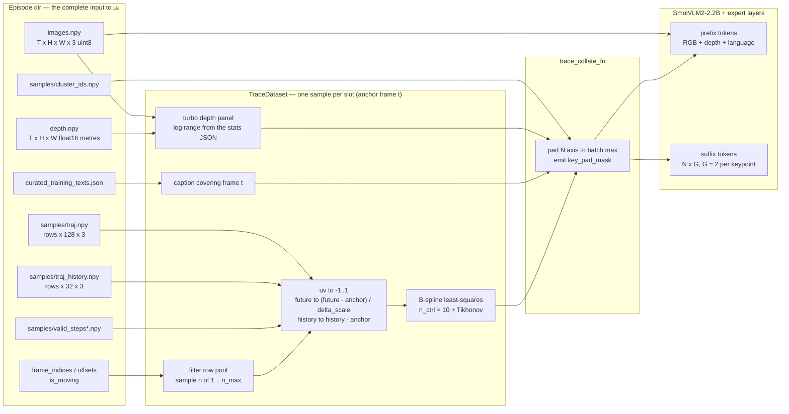
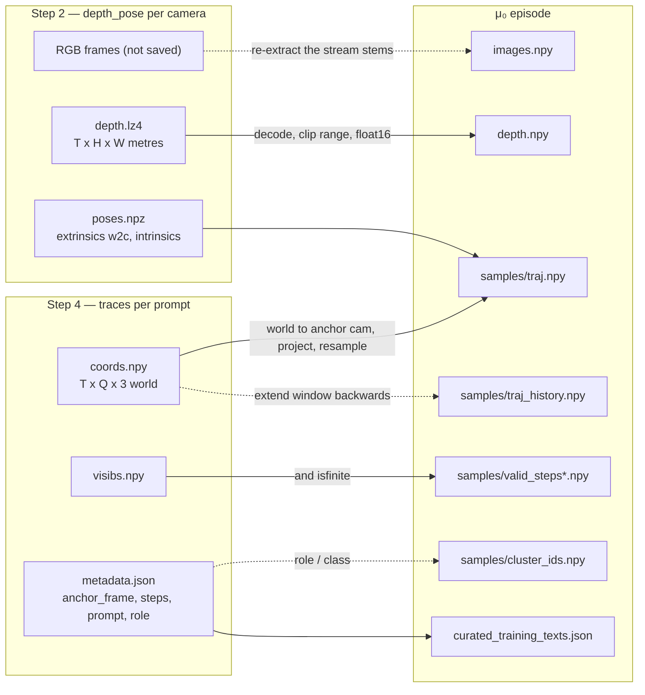

# μ₀ training data — the TraceExtract contract

This note explains **what the μ₀ model actually eats**, file by file, using the
shipped sample episode as ground truth:

```
mu0/test_set/test_dataset_egodex/part1__add_remove_lid__1036/
```

It is the reference for **mapping the astribot pipeline outputs
(`tools/astribot` Step 2 depth+pose, Step 4 traces) into μ₀ training episodes** —
see §6 for that mapping and the gaps.

Sources of truth, in order: the loader/consumer code
(`src/mu0/datasets/trace_dataset.py`, `src/mu0/policies/modeling_smolvla.py`),
the released checkpoint (`mu0/final_ckpt/config.json`,
`mu0/normalizer_stats.json`), and the measurements in §3.2 and §4 which were run
against the sample episode.

Everything the model needs is **already assembled per-sample by the loader**:
you do not feed raw videos to μ₀ — you produce a TraceExtract-format episode
directory, and the loader does the frame selection, normalization and B-spline
fitting.

---

## 1. The sample episode on disk

Only these files matter — this is the complete set μ₀ reads:

```
part1__add_remove_lid__1036/
├── images.npy                     (126, 360, 640, 3)  uint8    RGB frames, ~10 Hz
├── depth.npy                      (126, 360, 640)     float16  metric depth, metres
├── curated_training_texts.json     language annotations  → 'task' string(s)
└── samples/
    ├── frame_indices.npy          (125,)      int32   anchor frames: 0 … 124
    ├── offsets.npy                (126,)      int64   cumulative keypoint rows, 0 … 13207
    ├── is_moving.npy              (13207,)    bool    per-keypoint moving flag
    ├── cluster_ids.npy            (13207,)    int32   semantic cluster id per keypoint
    ├── traj.npy                   (13207, 128, 3) float16  current + 127 future steps  ← the target
    ├── traj_history.npy           (13207,  32, 3) float16  current + 31 past steps     ← the context
    ├── valid_steps.npy            (13207, 128) bool       future validity mask
    └── valid_steps_history.npy    (13207,  32) bool       history validity mask
```

The extractor also ships `keypoints.npy` (a redundant copy of `traj[:, 0, :2]`,
verified equal), `visibs.npy`, `raw_traj*.npy`, `raw_valid_steps*.npy`,
`cameras.npz`, `acceleration.npz`, `movement_statistics.npz`, `meta.json` and
`description.txt`. **μ₀ reads none of these** — a new dataset does not need to
produce them. (Note that `visibs.npy` being ignored is why a point that is
occluded but still *tracked* is training-legal.)

The leading dimension of every `samples/*.npy` array is **one row per keypoint per
anchor frame** (13 207 rows over 125 anchors ≈ 61–116 keypoints per anchor). A row
is a *complete local trajectory for one tracked point*: its past, its position now,
and its future. Rows are independent training units.

> μ₀ never sees a "video". It sees **slots**: one anchor frame + a set of keypoint
> rows valid at that frame.

### 1.1 Data flow



---

## 2. What the loader requires

| File | Required when | Notes |
|---|---|---|
| `images.npy` | always | |
| `depth.npy` | `--use_depth=true` | hard `FileNotFoundError` if the flag is on and the file is absent |
| `curated_training_texts.json` | optional | absent ⇒ empty caption ⇒ the trainer substitutes a default prompt |
| `samples/frame_indices.npy` | always | |
| `samples/offsets.npy` | always | |
| `samples/is_moving.npy` | always | pre-filters slots with `< n_min` moving keypoints |
| `samples/traj.npy` | always | header-checked; needs ≥ `future_len+1` columns |
| `samples/traj_history.npy` | always | needs ≥ `history_len+1` columns |
| `samples/valid_steps.npy` | always | |
| `samples/valid_steps_history.npy` | always | |
| `samples/cluster_ids.npy` | `--rigidity_regularization_weight > 0` | |

---

## 3. File reference

### 3.1 Slot bookkeeping (`frame_indices` / `offsets` / `is_moving`)

- `frame_indices[s]` — the **anchor frame** `t` of slot `s`; indexes into
  `images.npy` / `depth.npy`. In the sample: `0 … 124` (125 of the 126 stored
  images — the last frame has no future, so no slot).
- `offsets[s] … offsets[s+1]` — the **half-open row range** in every
  `samples/*.npy` array belonging to slot `s`. `offsets` has `len(frame_indices)+1`
  entries and `offsets[0] == 0`; its last entry equals the row count of `traj`
  (13 207 here).
- `is_moving[row]` — the per-keypoint moving flag. It gates slot *usability*
  (a slot with fewer than `n_min` moving rows is skipped at construction) and is
  the base pool that rows are sampled from. In the shipped sample episode it is
  **all-True**, so the filter is a no-op there.

### 3.2 Trajectories (`traj`, `traj_history`) — the core of the format

Both are `float16` arrays of shape `(rows, steps, 3)`, holding **`(u, v, z)`**:

| Component | Unit | Range | Notes |
|---|---|---|---|
| `u`, `v` | **pixels** in the anchor frame's image | may fall outside `[0,W]×[0,H]` for fast motion | the anchor row `traj[:, 0, :2]` is the point's current-frame pixel position |
| `z` | **metres**, along the anchor camera's optical axis | ~0.07–1.0 m in the sample | **z == `depth.npy[t]` sampled at `(u, v)`** — measured median error 1.5 mm over 1 910 keypoints across 18 anchors, 83 % within 1 cm |

Coordinates are in the **camera frame of the anchor frame `t`** — *not* world and
*not* the camera of the future timestep. A point that recedes from the camera has
a growing `z` in the anchor frame; the trajectory is a 3D curve as seen from
where the camera was at `t`.

**Column order — gotcha.** The *files* store the anchor in column 0 and then go
**backwards** in time:

- `traj_history[:, 0]` = the anchor frame `t` (identical to `traj[:, 0]`, verified)
- `traj_history[:, 1]` = `t-1`, `traj_history[:, 2]` = `t-2`, … `traj_history[:, 31]` = `t-31`
- `traj[:, 0]` = `t`, `traj[:, 1]` = the next step, … `traj[:, 127]`

The loader reads `history_len+1 = 9` columns and **reverses** them, so the model
sees `t-8 … t-1` oldest-first. `valid_steps_history` decays along those columns
(1.00 at the anchor → 0.71 at column 31) and `valid_steps` decays
1.00 → 0.94 at `t+12` → 0.24 at the last column (`t+127`) as tracks die or
leave the frame.

**Time base — the files' step is *not* the stored image.** This is the single
most consequential convention:

- `meta.json` records 376 source frames at 30 fps downsampled to the 126 stored
  images — i.e. the images are ~ every 3rd source frame (~10 Hz).
- 3 338 rows have *more valid trajectory columns than there are image frames
  left in the episode* (3 151 of them all 128 = 127 future steps), and at anchor
  image 0 alone 60 of 107 rows are valid across all 128 columns while only 125
  images remain. A trajectory step therefore **must** be finer than a stored
  image frame.
- Same-track displacement per trajectory step measures ~0.4–0.6× the
  displacement between two consecutive stored images — consistent with a finer
  step, and with the ~3× image downsampling (the measurement is noisy because
  row alignment across anchors is not guaranteed, see below).

**→ Treat one trajectory step as one *source* frame at `source_fps`.**
Consequences for the release settings (`history_len=8`, `future_len=32`): the
model's past context is 8 source frames ≈ 0.27 s and its forecast horizon is
32 source frames ≈ 1.07 s. The arrays ship 32 history columns and 128 trajectory
columns (current + 127 future), so up to 4× more horizon is available than the
recipe uses — the model consumes only
`traj[:, 1 : future_len+1]` (i.e. 32 steps) and the first 8 past steps.

**`traj` is a *retargeted* trace.** The extractor resamples the tracked path
before exporting it: verified on a fully-valid track, every `traj` point still
lies *on* the original polyline (median 0.05 px, max 0.22 px off) and follows it
at a near-identity step index — the same path, resampled and adjusted. What
matters for the model is that `traj`'s step is a *source-rate frame*, that column
0 is the anchor, and that the columns are as dense and gap-free as `valid_steps`
claims they are.

**Rows are not stable across slots.** Row `i` of slot `t` and row `i` of slot
`t+1` are the same tracked point only while the membership is unchanged
(verified aligned within ~2 px for the early anchors of the sample, but breaking
down later, where the per-slot keypoint count changes between 61 and 116).
Nothing downstream depends on cross-slot row identity — the loader samples rows
at random per slot — but **within a row** all arrays must describe the same
point: `(u,v,z)`, `valid_*`, and `cluster_ids` must be consistent column-by-column.

### 3.3 Language (`curated_training_texts.json`)

```json
{"video_id": "1036", "n_frames": 125,
 "chunk_texts": [{"chunk_id": 0, "start_idx": 0, "end_idx": 124,
                  "instruction_1": "...", "skill_labels": ["add"], "objects": ["cup", "lid"]}]}
```

The loader flattens `chunk_texts` + `merged_texts` into
`(start_idx, end_idx, [instruction_1/2/3])` entries; for an anchor frame `t` it
collects every entry with `start_idx <= t <= end_idx`, picks one entry
uniformly, then one of its paraphrases. An empty caption becomes the default
"predict future trajectory" prompt. Note `meta.json`'s `llm_description` is
**not** used — only the instructions inside this JSON are.

### 3.4 `images.npy` / `depth.npy`

- `images.npy` — `(T, H, W, 3)` **uint8 RGB** (the repo-wide pixel convention).
- `depth.npy` — `(T, H, W)` **float16 metres**, same `H, W` as the images
  (checked at construction). Invalid pixels are expected to be non-finite or
  ≤ 1e-3 and are rendered as "far" in the depth panel; the sample episode has no
  invalid pixels at all (simulated depth, 0.20–2.06 m).

### 3.5 `cluster_ids.npy` and the rigidity loss

Per-row `int32` cluster id from a semantic segmentation of the scene (observed
values `0…10`, 5 of them distinct in the sample episode; the model treats them
as opaque small integers). Used only by the rigidity
regularization term (`--rigidity_regularization_weight`, release value 5), which
penalizes variance of intra-cluster pairwise control-point distances. Padded
slots get `-1` in the collated batch so the loss can mask them with one `>= 0`.

---

## 4. From a slot to a model input

For one anchor frame `t`, `src/mu0/datasets/trace_dataset.py::_get_one`:

1. **Pick the row pool** — start from `is_moving` rows in the slot, then apply
   (optionally) future-motion filtering and the current-frame filter: the anchor
   `(u,v,z)` must be valid, finite and inside the image
   (`|u_norm| <= 1`, `|v_norm| <= 1`). Then sample `n ~ U[min(n_min, |pool|), min(n_max, |pool|)]`
   rows — `--n_min 1 --n_max 256` in the release recipe, i.e. **variable `N` per
   sample**, padded later.
2. **Normalize** `u, v`: `(u / W) * 2 - 1` → `[-1, 1]` (z stays in metres).
   Invalid steps are zeroed after normalization (the mask, not the value, is what
   the loss uses).
3. **Make the future anchor-relative and scaled**:
   `traj_future = (future_xyz - current_kp) / delta_scale`, per axis.
   The history is anchor-relative too but **not** scale-divided
   (`history_xyz - current_kp`).
4. **Fit the B-spline target** — least-squares fit of the (anchor-prepended,
   validity-weighted) future against a fixed cubic basis with `n_ctrl = 10`
   control points plus a Tikhonov term (`--trace_bspline_reg_lambda 0.2`,
   `--trace_bspline_reg_order 1`, then `--trace_bspline_ctrl_clip 1.5`) →
   `ctrl_pts_future (n, 10, 3)` in **scaled-delta space**, plus `valid_kp (n,)`
   = "has ≥ 10 valid future steps".
5. **Render the depth panel** — `render_depth_rgb(depth_meters, log_min, log_max)`
   (`src/mu0/datasets/trace_depth.py`): log-depth clipped to the dataset-global
   range, inverted, mapped through a 256-entry **turbo** LUT → `(3, H, W)` float
   `[0, 1]`. Near = bright, invalid = darkest. The range comes from the stats
   JSON (`depth_log_min/max`; release: `log(0.251) … log(2.145)` m). Because it
   is dataset-global, a metre value maps to the same colour in every frame.
6. **Resize** both panels to `image_size × image_size` (512) with a plain
   bilinear squash to square — not an aspect-preserving pad. Because uv was
   normalized per axis by the *source* `W, H`, the `[-1, 1]` frame still maps
   onto the full resized image.
7. **Collate** (`trace_collate_fn`) — pad the `N` axis to the batch max and emit
   `key_pad_mask`; images are stacked; captions stay a list of strings.

### The batch the model consumes

| Key | Shape | Dtype | Origin |
|---|---|---|---|
| `observation.images.cam_front` | `(B, 3, 512, 512)` | float32 | step 6 |
| `observation.images.cam_front_depth` | `(B, 3, 512, 512)` | float32 | step 5–6 (turbo panel) |
| `observation.language.tokens` / `.attention_mask` | `(B, ≤48)` | int64 / bool | tokenized `task` (`tokenizer_max_length=48`) |
| `traj_history` | `(B, N, 8, 3)` | float32 | steps 1–3; `t-8 … t-1`, anchor-relative, unscaled |
| `current_kp` | `(B, N, 3)` | float32 | anchor frame; `uv` normalized, `z` metres |
| `traj_future` | `(B, N, 32, 3)` | float32 | steps 2–3; scaled anchor-relative deltas |
| `ctrl_pts_future` | `(B, N, 10, 3)` | float32 | step 4 — **the FM target** |
| `valid_kp`, `valid_history`, `valid_future`, `key_pad_mask` | `(B, N)` / `(B, N, 8)` / `(B, N, 32)` | bool | masks |
| `cluster_ids` | `(B, N)` | int64 | rigidity loss only (`-1` = padded) |

Inside the model the trace part becomes a **suffix token stream**: `N × G` tokens
with `G = history_len/trace_group_horizon + n_ctrl/ctrl_per_token = 8/8 + 10/10 = 2`
per keypoint (one history token, one ctrl-pt token) at the release settings. The
prefix is the image + depth + language tokens; `current_kp[:, :2]` additionally
drives each token's 2D Fourier embedding and a bilinear DINOv2-base@518 sample
that is fused into the suffix.

### Normalization stats (`mu0/normalizer_stats.json`)

```json
{"delta_scale_x": 0.6625, "delta_scale_y": 0.7411, "delta_scale_z": 0.2075,
 "depth_log_min": -1.3824, "depth_log_max": 0.7629, "target_kind": "anchor", ...}
```

`delta_scale` is the per-axis 95th percentile of `|future - anchor|` over 60 M
sampled (row, step) pairs — a *dataset-global* scale factor, not per-episode.
Regenerate for a new domain with
`uv run python -m mu0.datasets.trace_delta_stats --help`; the trainer
auto-computes into the run dir when `--delta_stats_path` is omitted. A new
domain whose objects move very differently will want a new stats file (the
fine-tune flow warns about exactly this).

---

## 5. What this means for a *new* dataset

The contract you must satisfy to train μ₀ on anything else:

1. `images.npy` — RGB uint8 at a **single fixed rate**; that rate defines the
   meaning of `history_len`/`future_len` in seconds.
2. `depth.npy` — metric depth in metres, same grid as the images.
3. `samples/traj.npy` — per (anchor, keypoint) a `(steps, 3)` curve in the
   **anchor camera frame**: `u, v` in anchor-image pixels, `z` in metres
   (≈ the depth at the anchor pixel). Dense and gap-free as far as
   `valid_steps` says it is valid.
4. `samples/traj_history.npy` — the same, **backwards** from the anchor, with
   `valid_steps_history`.
5. `samples/valid_steps*.npy` — honest per-step validity. This is the only thing
   that tells the model *when a track stops being real*; a track that dies must
   go invalid, not continue with garbage.
6. `samples/frame_indices.npy`, `offsets.npy`, `is_moving.npy` — slot bookkeeping.
7. `samples/cluster_ids.npy` — only needed for the rigidity loss.
8. `curated_training_texts.json` — instructions with frame ranges.

That is the whole contract. Everything else the extractor ships
(`keypoints.npy`, `visibs.npy`, `raw_*`, `cameras.npz`, `meta.json`, …) is
ignored — emit it only if it helps you debug.

---

## 6. Mapping the astribot pipeline (Step 2 + Step 4) onto this contract

### 6.1 What the astribot steps write today

**Step 2** — `tools/astribot/run_step2_depth_stream.py` (layout via
`src/utils/astribot_paths.py`):

```
<out-dir>/ep{ep:03d}/subtask_{k:02d}/depth_pose/<camera>/
    depth.lz4      container → (T, H, W) float32 metres, log-encoded uint8 over [0.25, 1.25] m
    poses.npz      frame_indices (T,)    int64    absolute dataset frame indices
                   extrinsics    (T, 3, 4) float32  world→camera, SIM3-warped into chunk 0
                   intrinsics    (T, 3, 3) float32  pinhole K at the depth grid
                   shape         (2,)    int64    (H, W)
```

Steps stream **every `--stride`-th frame** (`--stride` default 4 → 7.5 Hz for a
30 fps dataset). Only these two files are written: **Step 2 does not persist the
RGB frames**, and frame identities are virtual (`poses.npz["frame_indices"]` is
the only record of which dataset frame a row is).

**Step 3** — `sampling_points/init_points/<camera>/<prompt_slug>/init_points.npz`:
`keypoints (K, N, 2) float32` full-frame **pixel** coords at the key-frame jpg
resolution, `frame_indices (N,) int64`, `masks`, `boxes`, `scores`.

**Step 4** — `tools/astribot/run_step4_traces.py`:

```
<out-dir>/ep{ep:03d}/subtask_{k:02d}/traces/<camera>/<prompt_slug>/
    coords.npy     (T, Q, 3) float32  world-space metres (Step-2 chunk-0 frame)
    visibs.npy     (T, Q)    bool     per-step tracked/visible
    queries.npy    (Q, 4)    float32  (home_frame=0, x, y, z) — the anchor points in world
    metadata.json  anchor_frame, steps[], num_steps, pixels[], query_keypoint_rows[],
                   role, prompt, image_size, vis_threshold, filter{...}
```

`T` = the steps of the window **from the anchor stem onwards**
(`run_step4_traces.py:873`), i.e. the trace has a future but no past.

### 6.2 The mapping



Detailed, per (episode, sub-task, camera):

| μ₀ file | From | Transform |
|---|---|---|
| `images.npy` | **missing** | ⚠️ Step 2 discards the RGB. Re-extract the stream stems from the LeRobotDataset (Step 1 `extract_frames` machinery), or add a save-RGB option to Step 2. Must be the same frames as `poses.npz["frame_indices"]`. |
| `depth.npy` | `depth.lz4` | decode to `(T, H, W)` float32 m → **float16**. ⚠️ Values are clipped to `[0.25, 1.25] m` at encode time; μ₀'s release depth range spans `0.251–2.145 m`, so far surfaces arriving from the astribot stream will already be saturated. Either raise the clip when generating, or regenerate `delta_stats` with a matching `depth_log_range`. |
| `samples/frame_indices.npy` | `poses.npz["frame_indices"]` | every stream stem becomes a candidate anchor; drop the tail that has no future. |
| `samples/traj.npy` | `coords.npy` + `poses.npz` | `poses.npz["extrinsics"]` is **world→camera** (`depth_to_point_cloud_vectorized` inverts it to reach world), so the camera frame at the anchor is just `p_cam = E_t · p_world` — **no inverse**. Then project: `u = fx·X/Z + cx`, `v = fy·Y/Z + cy`, keep `z = Z` in metres. Then **resample the time axis**: astribot steps are `--stride` apart (default 4), μ₀ wants source-rate frames — so either generate with `--stride 1`, or interpolate the trace to the source rate. Column 0 must be the anchor and columns `1…F` the future, at least `future_len+1 = 33` and ideally 128. |
| `samples/traj_history.npy` | ⚠️ **gap** | Step 4's window starts *at* the anchor, so there is no past. Run the tracking with a window that begins `history_len+1` stems before the anchor (and re-anchor the queries there), or emit zero history and accept that the model's context is empty. |
| `samples/valid_steps*.npy` | `visibs.npy` | `valid = visibs & isfinite(coords)`, sliced the same way as the trajectories. The current step is trivially valid (μ₀'s own files have `valid_steps[:,0] ≡ True`). |
| `samples/is_moving.npy` | `coords.npy` | derive from future displacement (or all-True, matching the shipped sample). |
| `samples/cluster_ids.npy` | roles/prompts | **substitute**: μ₀ wants a small integer per keypoint (semantic cluster). Use the Step-4 `role` (object/manipulator) or the RexOmni class per prompt. Required only when `--rigidity_regularization_weight > 0`. |
| `samples/offsets.npy` | derived | cumulative row counts over the anchors. |
| `curated_training_texts.json` | sub-task text | one entry per sub-task: `start_idx/end_idx` in *stored-image* indices, `instruction_1` = the sub-task/instruction string. |

### 6.3 Decisions to make before writing a converter

1. **Rate.** Generate traces at `--stride 1` (cleanest — then one μ₀ step = one
   dataset frame and the horizon is unambiguous), or keep `--stride 4` and
   interpolate to the source rate. Everything about `history_len`/`future_len`
   in seconds depends on this choice.
2. **Horizon.** A full 128-column trajectory (127 future steps) is 4.2 s at
   source rate and needs the tracking window to be that long; `future_len=32`
   (1.07 s) only needs 33 columns. Decide whether to emit 33 or 128.
3. **History.** Whether to extend the Step-4 window backwards (best: real
   history) or to zero it.
4. **Depth clip.** Raise the `depth.lz4` clip range above the μ₀ stats' `p99`
   (2.14 m) or regenerate the μ₀ stats for the astribot domain — otherwise the
   depth panel saturates and the model learns a distorted depth prior.
5. **Metric scale.** Astribot depth is metric *up to the accumulated SIM3 scale*
   of the streaming backends. μ₀'s `delta_scale` normalization was fit on metric
   data; if the astribot scale is off by a constant, the per-axis scale will
   absorb part of it — but gating the clip range assumes true metres, so verify
   the scale (e.g. against a known object size) before bulk generation.
6. **Keypoint budget.** μ₀ samples `n ∈ [1, n_max]` rows per slot from the
   available pool; Step 4 produces up to 1 088 queries per pass. No reshaping is
   needed — just make sure each emitted row is internally consistent.

---

## See also

- `docs/mu0/training.md` — how to run fine-tuning / evaluation on these episodes.
- `src/mu0/datasets/trace_dataset.py` — the loader (this document describes its
  behaviour; the docstrings there are the per-line source of truth).
- `mu0/docs/release/TRAINING.md` §2–§4 (in the μ₀ research checkout) — the
  original data-layout note and the golden training recipe.
- `docs/astribot/astribot_subtask_stream.md`, `docs/astribot/astribot_traces.md` —
  the Step-2 / Step-4 semantics (their *output-path* sections are stale; the
  paths in §6.1 above are the current ones).
